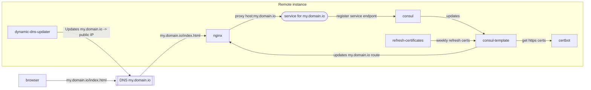

# Automatic Dynamic DNS on a single instance

[Installation](#installation) to a remote machine via a single command.

[Register your service](#add-a-new-service) with consul => https routing and letsencrypt certificates are automated.

Serve all your services/websites:
 - from a single instance
   - with a public IP address (public IP address can be dynamic)
 - with certificates automatically generated and updated
 - dynamically add services, routing/certificates automated




## Tasks

### Add a new service

**Short version:** (you have everything else set up already)

1. Remote: register the service (called "my_domain_com") with consul:
  - `curl --request PUT --data '{"id":"my_domain_com","name":"my_domain_com","port":3010,"check":{"name":"HTTP API on port 3010","interval": "2s","http":"http://localhost:3010"}}' localhost:8500/v1/agent/service/register`
2. That's it. Routing and certificates are handled automatically.
   - Multiple services on the same route can register, nginx will round-robin requests

**Long version:**

1. Host: add/edit the DynamicDNS updater (if required):
  - `dynamic-dns-updater/config.json`: https://github.com/qdm12/ddns-updater#configuration
  - `just deploy` to update the host
2. Remote: start a service named as the domain with `.` replaced by `_`:  `my.domain.com` => `my_domain_com`:
  - `docker run --rm -d --name my_domain_com -e PORT=3010 -p 3010:3010 ealen/echo-server`
  - `my_domain_com` will be rendered as `my.domain.com` in nginx
  - This example is startin the service on the host, but the service can be anywhere as long as it is reachable
3. Remote: register the service (called "my_domain_com") with consul.
  - Note the `path` and `domain` meta fields, and `"nginx-route"` tag, you need those to set routing rules:
    ```
    {
    "id": "my_domain_com",
    "tags": [
        "nginx-route"
    ],
    "name": "my_domain_com",
    "port": 3010,
    "check": {
        "name": "HTTP API on port 3010",
        "interval": "2s",
        "http": "http://localhost:3010"
    },
    "meta": {
        "path": "api/v1",
        "domain": "my.domain.com"
    }
}
    ```
  - `curl --request PUT --data '{"id":"{{domain}}/{{path}}","tags":["nginx-route"],"meta":{"path":"{{path}}","domain":"{{domain}}"},"name":"my_domain_com","port":3010,"check":{"name":"HTTP API on port 3010","interval": "2s","http":"http://localhost:3010"}}' localhost:8500/v1/agent/service/register`
    - https://www.consul.io/docs/discovery/services
    - Make sure that `"interval": "2s"` is less than `consul-template/config/consul-template-config.hcl:` `min = "3s"`
      - consul doesn't seem to get the timing right on rendering, the service must be registered as healthy *before* the templating process starts. This is not how consul is advertised to work (re-renders on any updates) and is possibly due to timing of the template render.
  - `consul` triggers an update to `consul-template` that updates `nginx`
1. Check URL, should work (URL is user controlled)
  - `curl https://my.domain.com` (or whatever you register)

### Remove a service

Remote:

```
  curl --request PUT localhost:8500/v1/agent/service/deregister/my_domain_com
```

https://www.consul.io/docs/discovery/services

### Installation

1. Host: clone this repo
   - Optional (TODO: is this required?):
     - add keys certs: https://learn.hashicorp.com/tutorials/consul/deployment-guide
     - TODO: this could be justfiled
2. Required:
   - Host machine:
     - `just` installed: https://github.com/casey/just
     - `docker`
     - ssh access to remote machine
     - env vars defined in `.env` or in env (values are examples):
       - `GITHUB_TOKEN=xxxxxxxxxxxx`
         - with `ghcr.io` write access
         - Host machine needs to push docker images
         - Remote machine needs to pull docker images
       - `TARGET_HOST=192.168.86.10`
       - `TARGET_USER=admin`
       - `CERTBOT_EMAIL=admin@mydomain.io`
   - Remote machine:
     - `docker`
     - External DNS configuration pointing to this machine (optional only needed for dynamic DNS):
       1. Add/edit the DynamicDNS updater (if required):
       2. `dynamic-dns-updater/config.json`: https://github.com/qdm12/ddns-updater#configuration
3. Host: install containers to remote
   - `just` (enters docker container with host mounted in)
   - `just deploy`: starts linked docker containers on host
4. [Add a new service](#add-a-new-service)


### Architecture

Goals:

   - Easily add/remove services to routes and automate domains/certificates/routing
   - use docker containers as much as possible
   - automate remote installation

Use case: you have a single machine reverse proxying your services.

Docker containers: `consul`, `nginx`, `certbot`, `consul-template`, plus `qmcgaw/ddns-updater`

And a little bit of scripting.

### Useful commands for debugging (on the remote machine)

#### See nginx https config

docker exec -ti dynamic-dns-nginx cat /etc/nginx/conf.d/load-balancer.https.conf

#### Run the templater manually

docker exec -ti dynamic-dns-consul-template consul-template -once -log-level debug -config=/etc/consul-template/config/consul-template-config.hcl

## Development

Run all services (except `consul-template`) daemonzied:

```
just dev -d consul refresh-certificates nginx
```

Then start some services and register them:

```
docker run -d --rm -e PORT=3000 -p 3000:3000 ealen/echo-server
```
```
curl --request PUT --data '{"id":"localhost","tags":["nginx-route"],"meta":{"path":"","domain":"localhost"},"name":"localhost","port":3000,"check":{"name":"HTTP API on port 3000","interval": "2s","http":"http://host.docker.internal:3000"}}' localhost:8500/v1/agent/service/register
```

```
docker run -d --rm -e PORT=3001 -p 3001:3001 ealen/echo-server
```
```
curl --request PUT --data '{"id":"localhost2","tags":["nginx-route"],"meta":{"path":"/api","domain":"localhost"},"name":"localhost2","port":3001,"check":{"name":"HTTP API on port 3001","interval": "2s","http":"http://host.docker.internal:3001"}}' localhost:8500/v1/agent/service/register
```

Then run the `consul-template` once command, and debug results:

```
just dc run consul-template consul-template -once -log-level debug -config=/etc/consul-template/config/consul-template-config.hcl

```

Look at the output, or the `load-balancer.json` output.

```
docker-compose exec -ti nginx cat /etc/nginx/conf.d/load-balancer.https.conf
```


## Reference blogs

https://mindsers.blog/post/https-using-nginx-certbot-docker/

## Similar repos

 - https://github.com/snw35/le-docker
   - does not use consul, does not automatically renew proxying and certificates on new services
